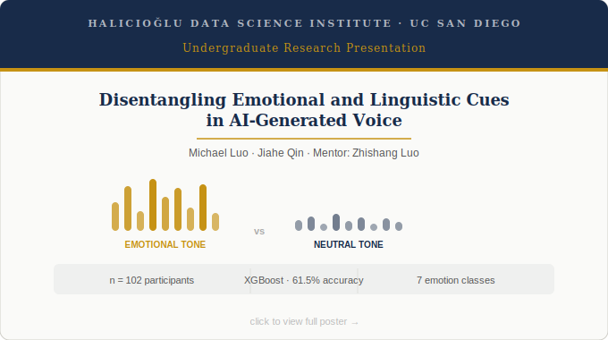

# Disentangling Emotional and Linguistic Cues in AI-Generated Voice

**Michael Luo · Jiahe Qin** | Mentor: Zhishang Luo  
Halıcıoğlu Data Science Institute, UC San Diego

---

[](poster/presentation.pdf)
> *Click to view the full UGS research poster.*

---

## Overview

Modern text-to-speech (TTS) systems (e.g. ElevenLabs, Amazon Polly) can simulate emotional speech without any underlying affective state. This raises a key question for human-AI interaction: **do listeners rely more on vocal tone or linguistic content when judging the emotion of AI-generated speech?**

This study uses a 2×2 factorial design — crossing **tone** (emotional vs. neutral) with **words** (emotional vs. neutral) — to isolate the independent and combined effects of prosody and linguistic content on perceived emotion, naturalness, and trust. We complement the behavioral study with an XGBoost classifier trained on acoustic features extracted from the stimuli to predict perceived emotion labels.

---

## Repository Structure

```
.
├── data/
│   ├── stimuli/              # 32 AI-generated audio clips (.mp3/.wav)
│   ├── survey_responses.csv  # Raw Qualtrics export (n=102, 489 ratings)
│   └── features.csv          # Extracted acoustic features per clip
├── notebooks/
│   ├── 01_feature_extraction.ipynb   # librosa feature extraction pipeline
│   ├── 02_statistical_analysis.ipynb # Kruskal-Wallis / chi-square tests
│   └── 03_ml_classification.ipynb    # XGBoost training and evaluation
├── results/
│   ├── figures/              # Bar charts, confusion matrix, feature importance plot
│   └── model/                # Saved XGBoost model (.json)
├── docs/
│   ├── poster.pdf            # UGS research poster
│   └── poster_thumbnail.png  # README preview image
└── README.md
```

---

## Experimental Design

Stimuli were generated using **ElevenLabs** TTS across four conditions formed by crossing tone and word valence:

| Condition | Tone | Words |
|---|---|---|
| In-Sync | Emotional | Emotional |
| Tone-Only | Emotional | Neutral |
| Word-Only | Neutral | Emotional |
| Control | Neutral | Neutral |

**32 clips** were created (8 per condition). **102 participants** recruited via Qualtrics each rated 5 randomly assigned clips, yielding **489 total ratings**. Participants rated each clip on:
- Perceived emotion (7-class label: angry, calm, disgusted, fearful, happy, neutral, sad)
- Emotion strength (1–5 Likert)
- Naturalness (1–5 Likert)
- Trust (1–5 Likert)
- Tone-vs-words weighting (1–5 Likert)

---

## Methods

### Acoustic Feature Extraction

Features were extracted per clip using [librosa](https://librosa.org/):

| Feature | Description |
|---|---|
| RMS | Signal energy / loudness |
| F0 (mean, std) | Fundamental frequency / pitch |
| ZCR | Zero-crossing rate — vocal roughness |
| Spectral centroid | Brightness of the sound |
| Spectral rolloff | High-frequency energy cutoff |
| Spectral bandwidth | Spread of frequency energy |
| MFCCs 1–13 (mean, std) | Timbre and vocal texture |

### Statistical Analysis

Kruskal-Wallis chi-square tests were used to compare distributions across the four conditions (non-parametric, given ordinal Likert data):

| Outcome | χ²(3) | p-value |
|---|---|---|
| Emotion strength | 88.87 | < 0.001 |
| Trust | 21.16 | < 0.001 |
| Naturalness | 13.20 | 0.004 |
| Tone-vs-words weighting | 8.98 | 0.030 |

### Machine Learning

An **XGBoost classifier** was trained to predict perceived emotion labels (7-class) from acoustic features, using a grouped train/test split by participant ID to prevent data leakage.

- **Test accuracy:** 61.5%
- **Best classes:** Angry (F1 = 0.76), Fearful (F1 = 0.74)
- **Hardest classes:** Disgusted (F1 = 0.38), Happy (recall = 0.31)

---

## Key Findings

- **Tone dominated over words** — participants' emotion ratings leaned toward tone across all conditions.
- **Aligned cues produced the strongest perceived emotion and highest naturalness** — emotional tone + emotional words yielded the most intense and realistic-feeling clips.
- **Neutral cues produced the highest trust** — users appear to prefer clarity over expressiveness when judging reliability.
- **Emotion strength was most sensitive to condition** (χ² = 88.87), suggesting that cue manipulation most directly affects affective intensity.
- Acoustic features (especially MFCCs, ZCR, spectral bandwidth, and F0) were sufficient to reach 61.5% accuracy across 7 emotion classes, but identical features sometimes mapped to different perceived labels, bounding classifier performance.

---

## Setup

```bash
git clone https://github.com/YOUR_USERNAME/ai-voice-emotion-perception.git
cd ai-voice-emotion-perception
pip install -r requirements.txt
```

**Requirements** (see `requirements.txt`):
- `librosa`
- `scikit-learn`
- `xgboost`
- `pandas`
- `numpy`
- `matplotlib`
- `seaborn`

To reproduce the analysis, run the notebooks in order:

```bash
jupyter notebook notebooks/01_feature_extraction.ipynb
```

---

## Citation

If you use this dataset, code, or findings in your work, please cite:

```bibtex
@misc{luo_qin_2025_ai_voice_emotion,
  author       = {Luo, Michael and Qin, Jiahe},
  title        = {Disentangling Emotional and Linguistic Cues in AI-Generated Voice},
  year         = {2025},
  institution  = {Halıcıoğlu Data Science Institute, UC San Diego},
  note         = {Undergraduate research poster presentation},
  url          = {https://github.com/YOUR_USERNAME/ai-voice-emotion-perception}
}
```

---

## Acknowledgements

- **Zhishang Luo** — research mentor, guidance on study design and analysis
- **ElevenLabs** — TTS platform used for stimulus generation
- **Qualtrics** — survey platform
- **UC San Diego** — funding for TTS access, participant incentives, and poster costs
- Open-source tools: Python, librosa, scikit-learn, XGBoost

---

## License

This project is licensed under the [MIT License](LICENSE). Audio stimuli generated via ElevenLabs are subject to their [Terms of Service](https://elevenlabs.io/terms).
